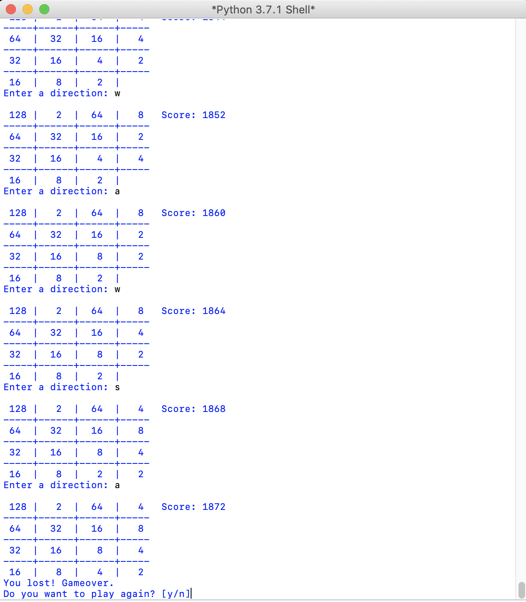

# 2048-Game (May 2018)

This is the popular game 2048 implemented in Python

## Get Started
1) Clone/download the project
2) Open the 2048game.py file with Python IDLE
3) Click Run

## Control
Use w,a,s,d to move (need to press enter to move)

## Demo

